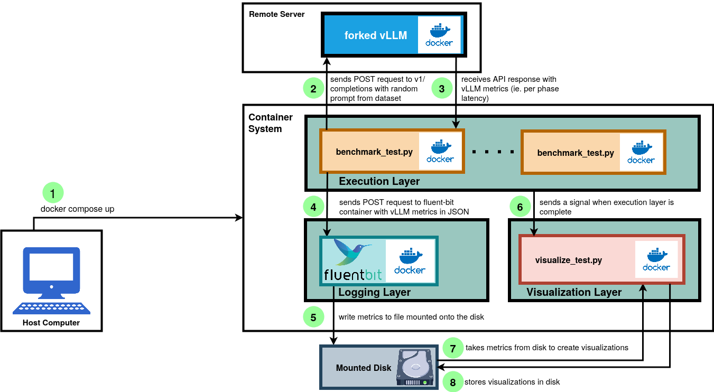

# Welcome to the vLLM Benchmark Tester:

This project is a multi-container vLLM Benchmark tester that integrates a containerized Python script, fluent-bit logger, and a visualizer. 

Before taking advantage of this Benchmark tester, you need to clone my fork of vLLM, which exposes specific internal metrics that vLLM uses, into a vLLM-compatible GPU workstation. You can find my fork of vLLM [here](https://github.com/CapeGenius/vllm-testing-project). 

## vLLM Benchmark Tester Architecture

If you want to get to setup, scroll down!



## Setting up my fork of vLLM:

1) After you've cloned my fork of vLLM into your workstation, run the following command:

```bash
nohup env DOCKER_BUILDKIT=1 docker build . \
  --target vllm-openai \
  --tag vllm/vllm-openai:from-source-v1 \
  --file docker/Dockerfile \
  --build-arg max_jobs=16 \ # change based on your workstation capability
  --build-arg nvcc_threads=2 \
  > build.log 2>&1 &
```
- Based on the size of your workstation, you can change the max_jobs and nvcc_threads. 
- The command above will build the docker image for this fork of vLLM. It can take from several minutes to an hour. 

2) Then, to start serving vLLM models, you can run the following command:

```bash
docker run --rm --gpus all \
    -v ~/.cache/huggingface:/root/.cache/huggingface \
    --env "HF_TOKEN=$HUGGING_FACE_HUB_TOKEN" \
    -p 8000:8000 \
    --ipc=host \
    vllm/vllm-openai:from-source-v1 \
    --model mistralai/Mistral-7B-v0.1 
    
```
- Note: make sure you have added your Hugging Face token to your .bashrc or a local .env file. 
- Note: If you get a triton error you can add the following line into the bash command: `-e TRITON_PTXAS_PATH="$(which ptxas)" \ `

3) After a few minutes, based on your firewall rules, your model should be serving and reachable from the IP address. Or if you're running this benchmark tester from the same GPU work station, you can use localhost. 

## Setting up vLLM Benchmarker:

Now that my fork of vLLM is running, you can set up my vLLM benchmarker, with the following steps after you clone this repo on any workstation:

1) I have included a sample.env file, which includes "default" values that you can change. Please make sure to make these changes according to the vLLM model that you are running. 
- In sample.env, you can choose select dataset, arrival rate, and number of requests. 


- Note, I've already provided two sample datasets from Hugging Face: 'nof-robots' and 'evol-codealpaca-v1'. If you want to add more, you can use the `get_datasets.py` file and select which online dataset that you want to use and load it into the dataset folder. 

2. After properly configuring the sample.env, you can go into the `src` directory, and run `docker compose up`. The docker-compose file will create a multi container system that will set up fluent-bit, execute the tests with the containerized Python testers, generate the plots for those tests, and load them into the `src/plots`.

- If you want to run more tests at once, you can simply run the command `docker compose up --scale=n`, where n is the number of containers that you want to build.
- Each time you change a parameter on the test, I recommend running `docker compose up --scale=n --build`. 

